<p align="right"><sup><a href="Configuring-the-Device-Tree.md">Back</a> | </sup><a href="../README.md#hps-and-fpga-communication"><sup>Contents</sup></a>
<br/>
<sup>HPS and FPGA communication</sup></p>

# Designing and Flashing the design

## Summary

This article explains how to build a design for our FPGA that can interact with our HPS. It will be a pretty simple design for which the HPS will communicate with the FPGA to blink the LEDs. But it's the starting point for building out more elaborate examples.

The vast majority of this page has been obtained from the excellent article [here](https://bitlog.it/20170820_building_embedded_linux_for_the_terasic_de10-nano.html), so be sure to check it out. I've updated it for Quartus 20.1 and made some minor changes based on our current approach.

## Steps

### Download the CD-ROM

Most SoC boards come with a GHRD (Golden Hardware Reference Design) or a GSRD (Golden System Reference Design) which showcases an example of how to use the board. It's easier to use than starting from scratch because a lot of the code is already pre-generated for you and the settings are already populated. You could build it from scratch (as done in [this video](https://www.youtube.com/watch?v=XXMeiVhjaZU&t=2268s)) and copy over the values from the GHRD as well if you like.

The first step is to download the CD-ROM. But there are different versions of the board and you need to download the right CD-ROM for your board. Fortunately, Terasic has a PDF on their [resources page](https://www.terasic.com.tw/cgi-bin/page/archive.pl?Language=English&CategoryNo=205&No=1046&PartNo=4) which explains how (title: 'How to distinguish the board revision and what's differents. (rev. A/B/B2/C Hardware)')

Here is a screenshot from the PDF:


In my case, I have revision `C`. So I will download the appropriate version of the CD-ROM.

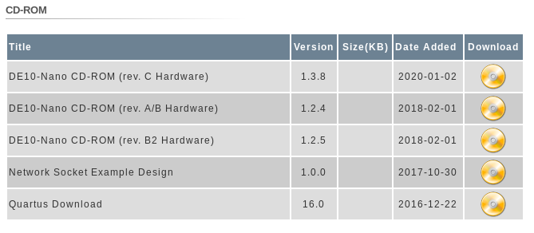

Download the file to our working directory. Then run the following commands to extract it:

```bash
mkdir -p cdrom
mv DE10-Nano_*_SystemCD.zip cdrom
cd cdrom
unzip *.zip
```

### Copy the GHRD to working directory

Let's copy the reference design to our working directory:

```bash
cd $DEWD
cp -r cdrom/Demonstrations/SoC_FPGA/DE10_NANO_SoC_GHRD ./
```

Now we're ready to make changes.

### Editing our design in Quartus

#### Open the Project

Run the following command in a terminal to fire up Quartus. We'll be using 20.1 which is the latest at the time of writing.

```bash
quartus
```

Click on `Open Project` and select the `.qpf` file in the GHRD that we copied:


You will see a note to upgrade IP. Click on the `Launch IP Upgrade Tool` and click on `Perform Automatic Upgrade`. Let it finish.

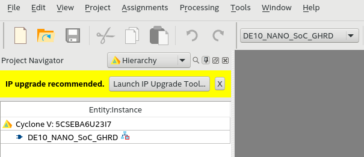

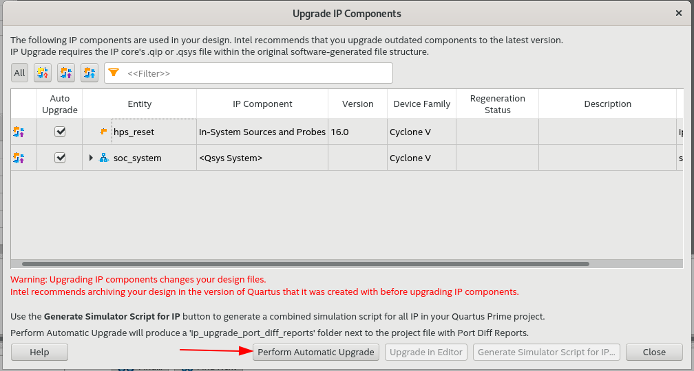

If you see an error saying that you need to upgrade it in Platform Designer, ignore it. It'll get upgraded in the next step. Hit the close button.


#### Platform Designer

##### Startup

Now let's fire up Platform Designer. In older versions of Quartus, this was called QSys, so you will still see a lot of references to it online. You can access it in `Tools -> Platform Designer`. Select `soc_system.qsys` in the file open dialog.


It should automatically upgrade your IP Cores to the current version.


There are a lot of IPs you can use in the left hand menu. The GHRD already uses a number of them. We are going to create our own custom component as a replacement for the parallel IO IP called `led_pio` in the design. So the first step is to remove the `led_pio` component from the system tree. Right click on it and select remove.


##### Custom component HDL code

Back in the terminal, in the folder below, create a new text file called `custom_leds.sv`

```bash
cd $DEWD
mkdir -p DE10_NANO_SoC_GHRD/ip/custom_leds
touch DE10_NANO_SoC_GHRD/ip/custom_leds/custom_leds.sv
```

Paste the following code in the file. This code along with most of the process has been copied from [bitlog.it](https://bitlog.it/20170820_building_embedded_linux_for_the_terasic_de10-nano.html):

```verilog
module custom_leds
(
    input  logic        clk,                // clock.clk
    input  logic        reset,              // reset.reset

    // Memory mapped read/write slave interface
    input  logic        avs_s0_address,     // avs_s0.address
    input  logic        avs_s0_read,        // avs_s0.read
    input  logic        avs_s0_write,       // avs_s0.write
    output logic [31:0] avs_s0_readdata,    // avs_s0.readdata
    input  logic [31:0] avs_s0_writedata,   // avs_s0.writedata

    // The LED outputs
    output logic [7:0]  leds
);

// Read operations performed on the Avalon-MM Slave interface
always_comb begin
    if (avs_s0_read) begin
        case (avs_s0_address)
            1'b0    : avs_s0_readdata = {24'b0, leds};
            default : avs_s0_readdata = 'x;
        endcase
    end else begin
        avs_s0_readdata = 'x;
    end
end

// Write operations performed on the Avalon-MM Slave interface
always_ff @ (posedge clk) begin
    if (reset) begin
        leds <= '0;
    end else if (avs_s0_write) begin
        case (avs_s0_address)
            1'b0    : leds <= avs_s0_writedata;
            default : leds <= leds;
        endcase
    end
end

endmodule // custom_leds
```

The code you see here implements the Avalon MM Slave interface for both read and write operations. If this sounds like greek and latin to you, take heart you are not alone.

The Avalon Bus is Altera's way of having the HPS and FPGA communicate with each other. Xilinx uses the AXI Bus which is different, but serves the same purpose. Before QSys/Platform Designer came along, if you wanted to have them interact using Avalon, you'd have to learn all the details about the bus and implement everything yourself in hardware. Platform Designer does the wiring and instantiation of the Bus pretty seamless. The code above enables the HPS to write to a memory location to have the FPGA automatically read and perform an action, which in our case is turning the LEDs either on or off.

Depending on your needs, you may want to explore more on the Avalon bus, but this is about as much as we'll talk about in this guide.

##### Creating a Custom Component

Back in Platform Designer, let's create a new component. Go to `File > New Component` and fill in the details:

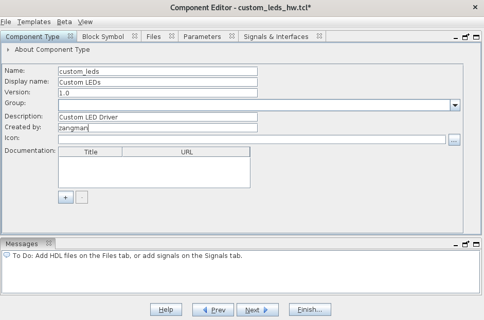

Click on the `Files` tab and click on the button `Add File...` and select the `custom_leds.sv` file we just created. Then click on the button `Analyze Synthesis Files`. If you see any errors, don't worry about them, we'll fix them in the next step.

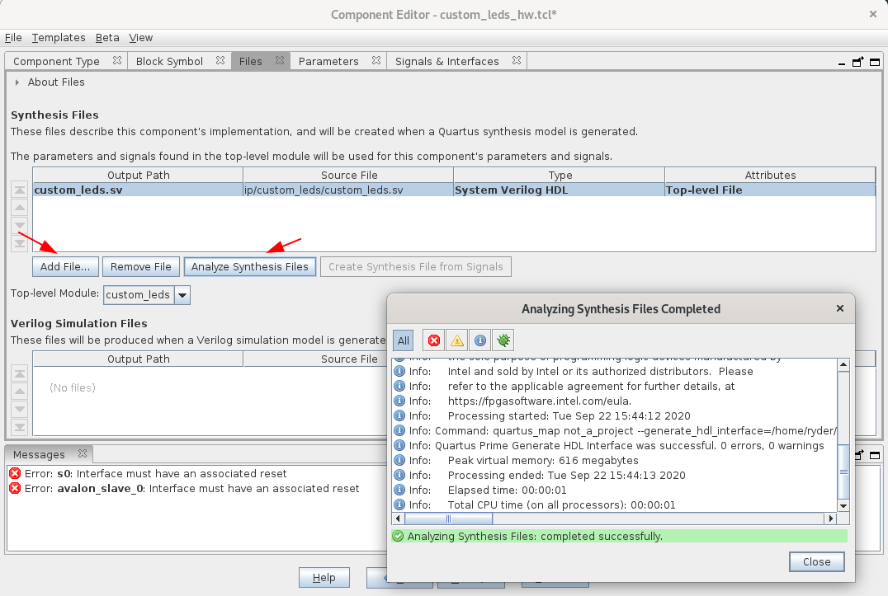

Click on the `Signals & Interfaces` tab at the top. We'll modify the names to match the guide at [bilogit.it](https://bitlog.it/20170820_building_embedded_linux_for_the_terasic_de10-nano.html) and assign clock and reset where missing. Here is what mine looks like when I open it:

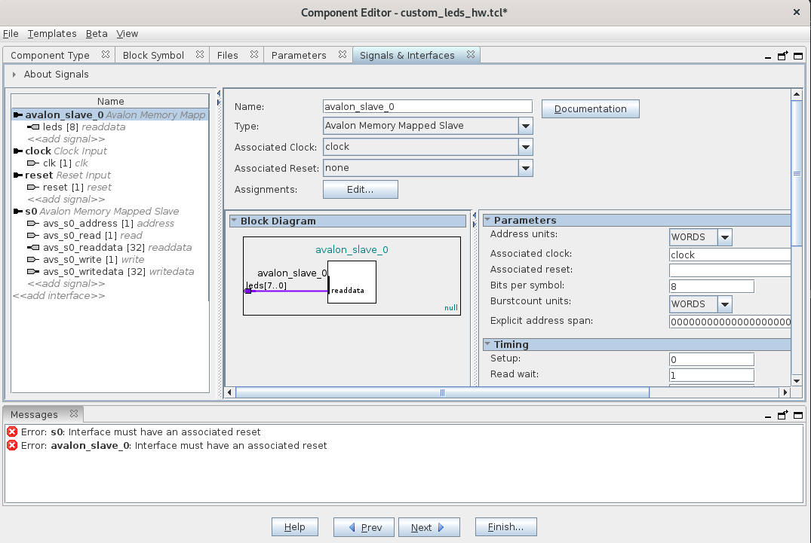

Rename `avalon_slave` to `leds`, change the `Type` to `Conduit` and set the `Associated Reset` to `reset`:

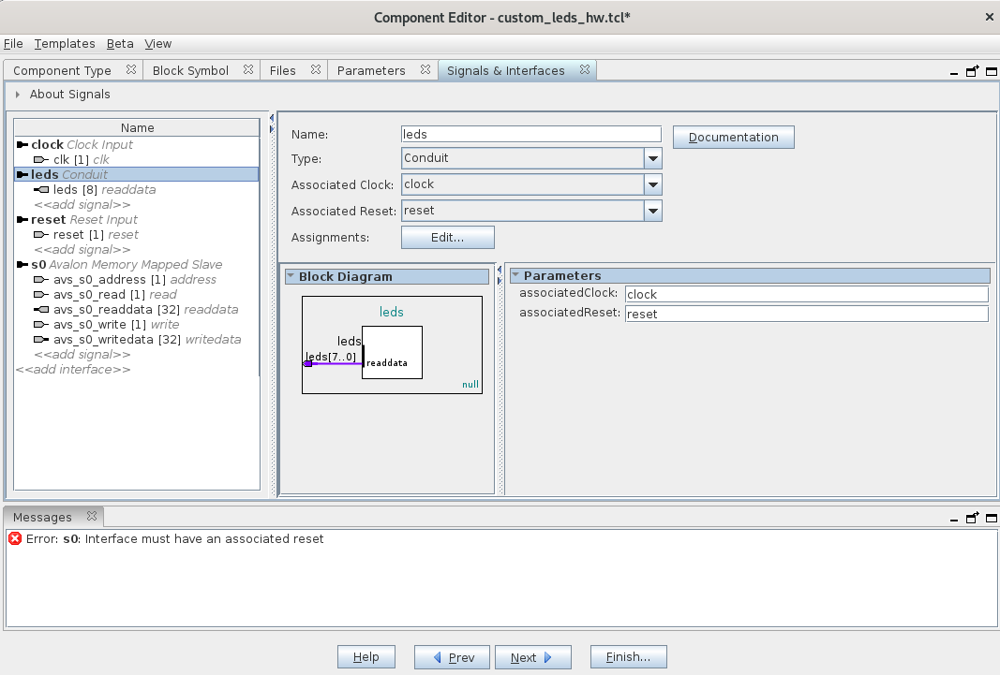

Click on the signal `leds [8]` and change the `Signal Type` to `new_signal`. It won't be in the dropdown, you'll need to type it in.

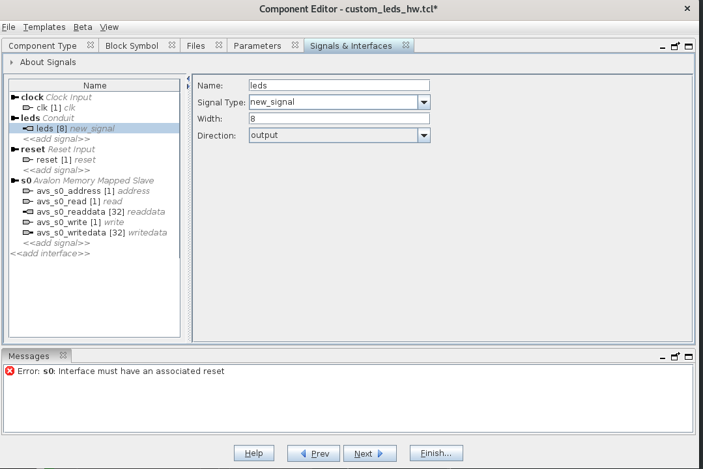

Next rename `s0` to `avs_s0` and assign the reset:

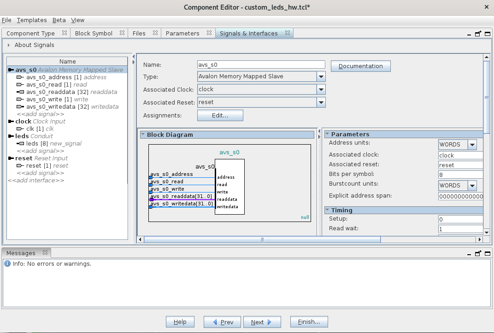

Once done, check that there are no errors in the messages panel and click on the button `Finish...`. In the pop-up dialog, click on `Yes, Save` and that completes our custom component.

##### Connecting the system

We've created our IP, but haven't added it to our design yet. So let's do it now. In the Platform Designer window, you'll see the new IP we created in the `IP Catalog` panel. Double Click it to open the panel for it and click on `Finish`:

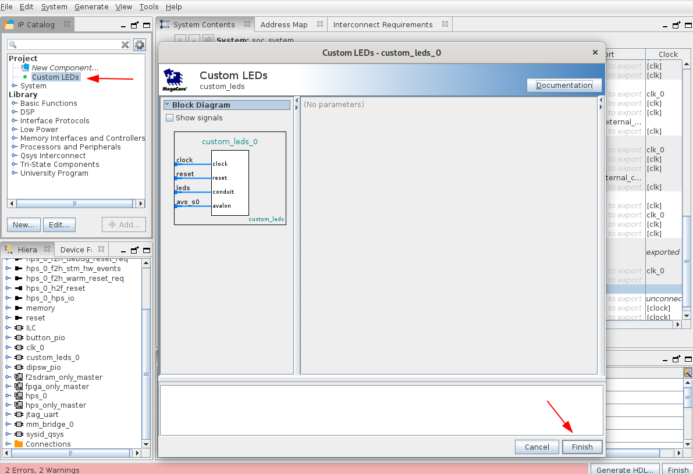

We haven't wired our IP to the Avalon bus. We'll make the following connections:

- `clk_0.clk -> custom_leds_0.clock`
- `clk_0.reset -> custom_leds_0.reset`
- `mm_bridge_0.mo -> custom_leds_0.avs_s0`
- `fpga_only_master.master -> custom_leds_0.avs_s0`

You can click on the highlighted junctions below to make the necessary connections:

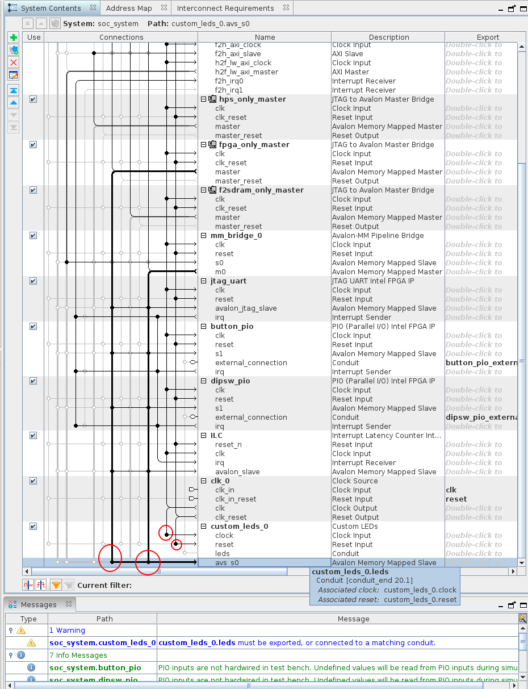

Lastly, right click the leds conduit and export it as `custom_leds_0_leds` as shown below:

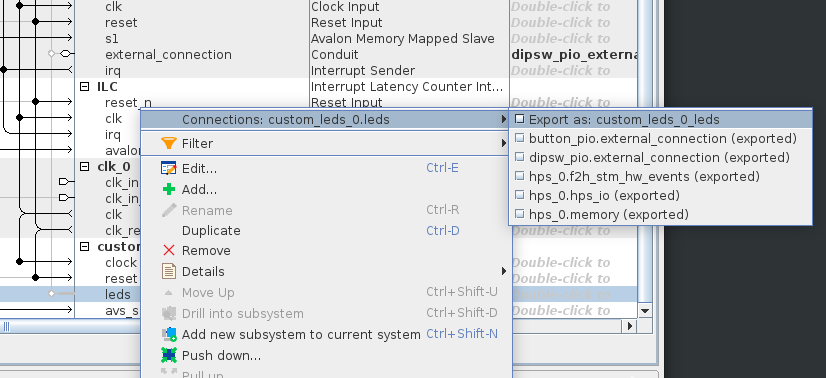

##### Generating the HDL

First of all, hit `Ctrl + S` to save your design. Then click on the button `Generate HDL...` at the bottom right to generate to open the `Generation` window. The default options are fine, just click on `Generate`. This will generate all the verilog code needed for our Avalon Bus and wires everything together. Wait for it to finish and click `Close` and then click on `Finish` on Platform Designer. We're done with this step.

#### Synthesis

When you close the Platform Designer, back in Quartus, you may receive a notification to add the `.qip` to the project. We can ignore this step because we're using the GHRD since it is already added. If we started a project from scratch, we would have had to manually add it.

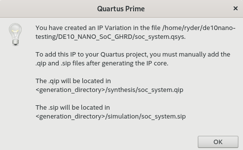

You can verify this by changing the `Project Navigator` dropdown to `Files` and check that the `.qip` file is indeed included in the project:

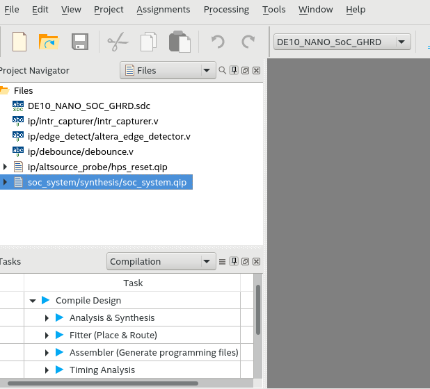

Change the dropdown back to `Hierarchy` and double-click the main module to open our top level module. Remember we removed the `led_pio` IP and added our own IP called `custom_leds`. We need to replace it in the top level module as well. Comment out the line that connects `led_pio_external_connection_export` and replace it with `custom_leds_0_leds_new_signal` as shown below:

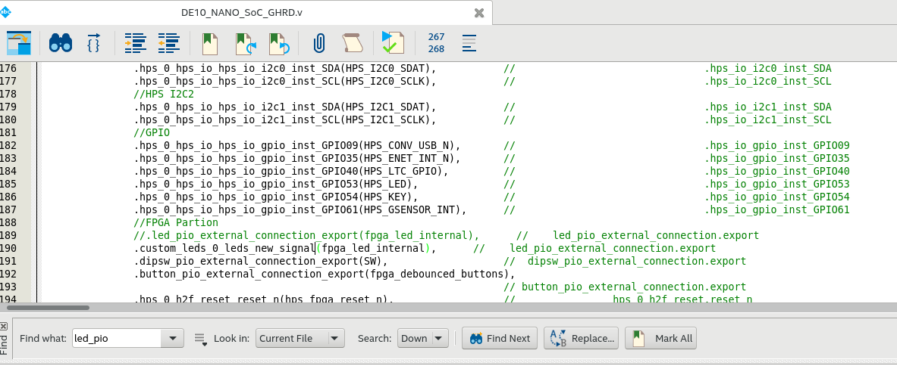

Hit `Ctrl+S` to save and then double-click to build our design. This can take 10-15 minutes to complete.

#### Convert file to `.rbf`

The last step is to convert the file to `.rbf` format as explained [here](./Flash-FPGA-from-HPS-running-Linux.md#create-a-blink-design).

Once converted, you can program the FPGA either on [boot-up](./Flash-FPGA-On-Boot-Up.md) or from [the HPS](./Flash-FPGA-from-HPS-running-Linux.md). If you are programming it from the HPS, then remember that the FPGA will get wiped when you power down the board. If this is a problem for you then the boot-up method might be preferable. The GHRD includes a module that will cause one of the LEDs to blink continuously. If you see this, congratulations, your design is up and running.

### Program to interact between the HPS and the FPGA

Now that we've got the FPGA flashed, we'll write a program that will cause the LEDs to flash. We'll use the cross-compiling method to build the binary on our host Debian system and then copy it over to the DE10-Nano. Run the following commands to create a file:

```bash
cd $DEWD
mkdir -p hps_fpga
cd hps_fpga
nano blink_leds.c
```

In the file, copy paste the following code. This is copy pasted directly from [bilogit.it](https://bitlog.it/20170820_building_embedded_linux_for_the_terasic_de10-nano.html):

```C
#include <stdio.h>
#include <fcntl.h>
#include <stdlib.h>
#include <unistd.h>
#include <error.h>
#include <stdint.h>
#include <sys/mman.h>

#include "hps_0.h"

// The start address and length of the Lightweight bridge
#define HPS_TO_FPGA_LW_BASE 0xFF200000
#define HPS_TO_FPGA_LW_SPAN 0x0020000

int main(int argc, char ** argv)
{
    void * lw_bridge_map = 0;
    uint32_t * custom_led_map = 0;
    int devmem_fd = 0;
    int result = 0;
    int blink_times = 0;

    // Check to make sure they entered a valid input value
    if(argc != 2)
    {
        printf("Please enter only one argument that specifies the number of times to blink the LEDs\n");
        exit(EXIT_FAILURE);
    }

    // Get the number of times to blink the LEDS from the passed in arguments
    blink_times = atoi(argv[1]);

    // Open up the /dev/mem device (aka, RAM)
    devmem_fd = open("/dev/mem", O_RDWR | O_SYNC);
    if(devmem_fd < 0) {
        perror("devmem open");
        exit(EXIT_FAILURE);
    }

    // mmap() the entire address space of the Lightweight bridge so we can access our custom module
    lw_bridge_map = (uint32_t*)mmap(NULL, HPS_TO_FPGA_LW_SPAN, PROT_READ|PROT_WRITE, MAP_SHARED, devmem_fd, HPS_TO_FPGA_LW_BASE);
    if(lw_bridge_map == MAP_FAILED) {
        perror("devmem mmap");
        close(devmem_fd);
        exit(EXIT_FAILURE);
    }

    // Set the custom_led_map to the correct offset within the RAM (CUSTOM_LEDS_0_BASE is from "hps_0.h")
    custom_led_map = (uint32_t*)(lw_bridge_map + CUSTOM_LEDS_0_BASE);

    // Blink the LED ten times
    printf("Blinking LEDs %d times...\n", blink_times);
    for(int i = 0; i < blink_times; ++i) {
        // Turn all LEDs on
        *custom_led_map = 0xFF;

        // Wait half a second
        usleep(500000);

        // Turn all the LEDS off
        *custom_led_map = 0x00;

        // Wait half a second
        usleep(500000);
    }

    printf("Done!\n");

    // Unmap everything and close the /dev/mem file descriptor
    result = munmap(lw_bridge_map, HPS_TO_FPGA_LW_SPAN);
    if(result < 0) {
        perror("devmem munmap");
        close(devmem_fd);
        exit(EXIT_FAILURE);
    }

    close(devmem_fd);
    exit(EXIT_SUCCESS);
}
```

Hang on! We don't have the header file `hps_0.h`. This header file contains all the memory addresses that we need for our leds.

Once quartus completes synthesis, it would have created a file called `soc_system.sopcinfo` which contains all the address information. The Embedded Development Suite that we installed in the beginning includes a utility that will help generate our header file. Run the following commands to generate the header file. Note that this requires you to have correctly set up the [development environment](./Setting-up-the-Development-Environment.md) along with the paths, otherwise they won't work.

```bash
cd $DEWD/DE10_NANO_SoC_GHRD

# Set up the paths.
embedded_command_shell.sh

# Generate the header.
sopc-create-header-files soc_system.sopcinfo --single hps_0.h --module hps_0
cp hps_0.h $DEWD/hps_fpga

# Let's get out oof the embedded_command_shell.
exit
```

Now we're ready to build our program:

```bash
cd $DEWD/hps_fpga

# Use the cross compiler to generate the executable.
${CROSS_COMPILE}gcc blink_leds.c -o blink_leds
```

This will have created an executable called `blink_leds`. Let's copy this onto the DE10-Nano and see if it works:

```bash
scp blink_leds root@<ipaddress>

# Pass the number of times you want it to blink.
./blink_leds 4
```

You should see all the LEDs blink 4 times.

#### (Optional) Compiling on the DE10-Nano

You can also compile the code on the DE10-Nano. You will need to install `gcc` though. Run the following command on your DE10-Nano:

```bash
sudo apt install build-essential
```

After it completes, if you have the `.c` and `.h` file copied over to the root folder on the DE10-Nano, you can build the executable as follows:

```bash
gcc blink_leds.c -o blink_leds
```

## Appendix

### C++ Code

My attempt at writing the same blink program in C++. Problem is `mmap`, `open` etc are unix functions and there's no equivalent for C++. So it's not really that different from the C code. But it is useful if we want to use some of the C++ specific features like `std::vector` etc in the future.

```C++
#include "hps_0.h"

#include <iostream>

#include <fcntl.h>
#include <unistd.h>
#include <sys/mman.h>

int main(int argc, char* argv[]) {
  if (argc != 2) {
    std::cerr << "Missing argument on how many times to blink led." << std::endl;
    return -1;
  }
  constexpr uint32_t HPS_TO_FPGA_LW_BASE = 0xFF200000;
  constexpr uint32_t HPS_TO_FPGA_LW_SPAN = 0x0020000;

  int blink_times = std::stoi(argv[1]);

  int devmem_fd = open("/dev/mem", O_RDWR | O_SYNC);
  if (devmem_fd < 0) {
    std::cerr << "Couldn't open /dev/mem\n";
    return -1;
  }

  auto lw_bridge_map = static_cast<uint32_t*>(mmap(
        nullptr,
        HPS_TO_FPGA_LW_SPAN,
        PROT_READ | PROT_WRITE,
        MAP_SHARED,
        devmem_fd,
        HPS_TO_FPGA_LW_BASE
        ));

  if (lw_bridge_map == MAP_FAILED) {
    std::cerr << "Couldn't create mmap.\n";
    return -2;
  }

  uint32_t* custom_led_map = lw_bridge_map + CUSTOM_LEDS_0_BASE;

  for (int i=0; i<blink_times; ++i) {
    *custom_led_map = 0xFF;
    usleep(500000);
    *custom_led_map = 0x00;
    usleep(500000);
  }

  std::cout << "Done.\n";


  int result = munmap(lw_bridge_map, HPS_TO_FPGA_LW_SPAN);
  if(result < 0) {
    std::cerr << "Couldn't unmmap.\n";
    return -3;
  }


  close(devmem_fd);

  return 0;
}
```

Compile this code as follows:

```bash
${CROSS_COMPILE}g++ -std=c++17 blink_leds.cc -o blink_leds
```

## References

[Building embedded linux for the Terasic DE10-Nano](https://bitlog.it/20170820_building_embedded_linux_for_the_terasic_de10-nano.html) - Most of this article has been adapted from here.

[How to Create a Device Tree](https://rocketboards.org/foswiki/Documentation/HOWTOCreateADeviceTree) - Excellent article on how to create a device tree for Cyclone V.

[Custom component development using Avalon and AXI interfaces](https://www.youtube.com/watch?v=Vw2_1pqa2h0) - Very informational training video that explains a lot of the magic going on in this article (posted in 2018 by Intel/Altera).

##

<p align="right">Back | <b><a href="Configuring-the-Device-Tree.md">Configuring the Device Tree</a></p>
</b><p align="center"><sup>HPS and FPGA communication | </sup><a href="../README.md#hps-and-fpga-communication"><sup>Table of Contents</sup></a></p>
