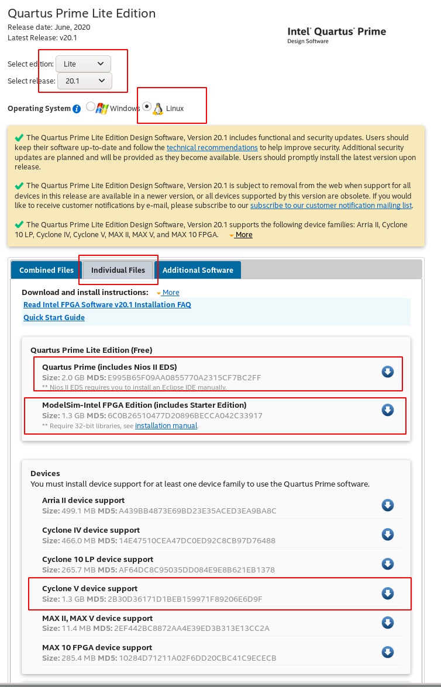
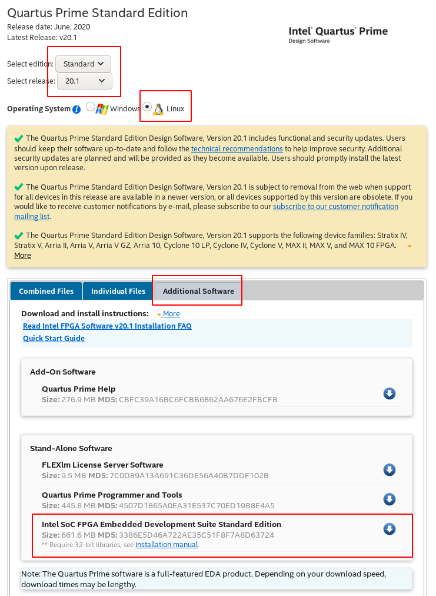

<p align="right"><sup><a href="Introduction-to-DE10-Nano.md">Back</a> | </sup><a href="../README.md#getting-started"><sup>Contents</sup></a>
<br/>
<sup>Getting Started</sup></p>

# Setting up the Development Environment

## Summary

Here we will take some time to set up our development environment. This environment will be similar to what was used for creating this guide. This will ensure that:

- All the commands used in this guide work seamlessly.
- You can close your session and/or restart your terminal without having to do the set up again.

## Operating System

We will use Debian as the main OS for everything. At the time of writing this guide, buster is the latest version of Debian. A complete list of Debian releases can be viewed in the [Index of releases](https://www.debian.org/releases/#:~:text=for%20detailed%20information.-,Index%20of%20releases,-The%20next%20release). I strongly recommend using Debian for your development environment, it will save you a fair bit of time debugging and makes it easier to follow along with all the commands.

This guide does not go into the details of installing Debian, there are plenty of resources available online. You can use [virtualbox](https://www.virtualbox.org/) as well if you don't have a dedicated Debian machine. That's what I used.

### Important: Storage space

I would suggest having at least 200 GB of disk space available when starting out. You can probably get away with 100 GB, but it's better to have a buffer. FPGA software and building a working Linux distro requires a fair bit of space. If you are using virtualbox and don't currently have that amount of space, I would suggest that you make the space available before you begin rather than resizing it later. This will save a bit of hassle.

Proceed to the next step after you have a working Debian install. If you are using virtualbox, make sure you have Virtualbox Guest Additions installed so that you can have full screen working.

### Setting up sudo

Typically Debian doesn't setup sudo for you and I prefer to use sudo rather than run commands as a root user. This guide assumes sudo is already enabled and setup, but if not [Google is your friend](https://www.google.com/search?q=debian+setup+sudo).

You can also choose not to use sudo. Simply run the command `su` to become root and run the command without `sudo`.

## Quartus Download and Install

The following software is needed. All the tools are free, but you will need to create an account in order to download. The software can be obtained from [Intel's FPGA Software Download Center](https://www.intel.com/content/www/us/en/collections/products/fpga/software/downloads.html?s=Newest).

Download the following by choosing the latest available Quartus Lite version. This guide will use version 20.1:

- Quartus Prime Lite Edition
  - Quartus Prime (Includes Nios II EDS)
  - ModelSim-Intel FPGA Edition (includes Starter Edition)
    (Required for design simulation)
  - Cyclone V device support
- Quartus Standard Edition
  - Intel SoC FPGA Embedded Development Suite Standard Edition

Refer to the screenshots below:





Quartus Prime installer can install the other tools as well if they are all present in the same directory. So it is advisable to wait until all the files are downloaded before you install them.

Once downloaded, you will need to make the installer executable. I downloaded all the files into `~/Downloads/quartus_downloads`. Modify the commands below accordingly depending on where you downloaded the files.

```bash
cd ~/Downloads/quartus_downloads/
chmod +x *.run

# Install Quartus Prime. Replace this with the version you downloaded.
# This takes 15-20 mins to complete.
# The default install location is fine i.e. ~/intelFPGA_lite
./QuartusLiteSetup-20.1.0.711-linux.run

# Once it completes, install EDS.
# Make sure to change the install location from ~/intelFPGA to ~/intelFPGA_lite.
./SoCEDSSetup-20.1.0.711-linux.run
```

Let's edit `.bash_aliases` so that we the quartus tools are easily accessible:

```bash
echo "" >> ~/.bash_aliases
echo "# Path for Quartus tools." >> ~/.bash_aliases

# Access to quartus, qsys etc.
echo "export PATH=$HOME/intelFPGA_lite/20.1/quartus/bin:\$PATH" >> ~/.bash_aliases

# Access to embedded_command_shell.sh which sets up the
# environment variables so that all the embedded tools are available
# like bsp-settings-editor etc.
echo "export PATH=$HOME/intelFPGA_lite/20.1/embedded:\$PATH" >> ~/.bash_aliases
```

### [Optional] Access JTAG as normal user

If you want to program the de10-nano as a simple FPGA, you will need to use the JTAG programmer present on the board and set the MSEL pins as follows:

1-ON

2-OFF

3-ON

4-ON

5-OFF

In [Manjaro linux](https://manjaro.org/) the JTAG programmer on the de10-nano is not accessible as a normal user. This makes it a bit annoying to program the device when working with quartus.

One option is to just `sudo` the command line `quartus_pgm` to program your device. The syntax and example command to do this is as follows:

```bash
sudo quartus_pgm -m JTAG -o "p;/home/mango/fpga/de10-nano-30-sep-21/blink/output_files/blink.sof@2"
```

But if you'd like to use the Programmer available in the Tools menu in Quartus, then you need to change the permissions for the usb device to be accessible to everyone.

After connecting the cable to your machine, run `lsusb` to list all the usb devices:

```bash
~ > lsusb
...
Bus 001 Device 013: ID 09fb:6810 Altera
...
~ >
```

We need to set up a udev rule for this as follows. Create a new file as follows:

```bash
sudo vim /etc/udev/rules.d/45-altera.rules
```

Paste the following after replacing the values correspondingly from `lsusb`:

```bash
SUBSYSTEM=="usb", ATTR{idVendor}=="09fb", ATTR{idProduct}=="6010", MODE="0666", GROUP="users"
```

Save the file and exit. Restart your machine and the device should now be accessible to all users.

This completes the Quartus section of the setup.

## Working Directory

I prefer to be organized. And we'll be working with a very large number of files and directories, so it's better to keep things organized from the beginning.

Let's create a dedicated working directory for this project and make sure we always have it available. You can call it whatever you like, I will call mine `de10nano-wd`:

```bash
cd
mkdir de10nano-wd
export DEWD=$PWD/de10nano-wd

# Add it to bash_aliases so that we don't have to do this everytime.
echo "" >> ~/.bash_aliases
echo "# DE10-Nano working directory" >> ~/.bash_aliases
echo "export DEWD=$PWD/de10nano-wd" >> ~/.bash_aliases
```

## ARM Compiler

The DE10-Nano has an ARM Cortex A9 HPS processor. Your Debian install probably has an i686 processor. The compilers for both are not compatible. So when compiling the kernel or writing programs for the HPS on your Debian desktop, you will need to use a compatible compiler. Otherwise it will fail.

Here we will set up the environment to use the Linaro GCC to enable cross compiling.

> **Did you know?**
>
> Cross compiling is the term used when you are compiling programs for one architecture (ARM in this case) on another architecture (i686 in our case)

### Get a suitable ARM compiler

Head over to the [downloads page at Linaro](https://www.linaro.org/downloads/) and download the latest binary release for `arm-linux-gnueabihf`. This is the version of `gcc` that we will use to compile our kernel with. The latest version at the time of writing is `7.5.0-2019.12`. We will fetch the `x86_64` release because we're using Debian on a 64-bit machine.

```bash
cd $DEWD
wget https://developer.arm.com/-/media/Files/downloads/gnu-a/10.3-2021.07/binrel/gcc-arm-10.3-2021.07-x86_64-arm-none-linux-gnueabihf.tar.asc

tar -xf gcc-arm-10.3-2021.07-x86_64-arm-none-linux-gnueabihf.tar.asc

# Delete the archive since we don't need it anymore.
rm gcc-arm-10.3-2021.07-x86_64-arm-none-linux-gnueabihf.tar.asc
```

Set the `CROSS_COMPILE` environment variable to point to the binary location. This is to tell the kernel `Makefile` where the compiler binary is located.

```bash
export CROSS_COMPILE=$DEWD/gcc-arm-10.3-2021.07-x86_64-arm-none-linux-gnueabihf/bin/arm-none-linux-gnueabihf-
```

With this step, we are done. However, if we close the current terminal or restart the machine, we will lose the `CROSS_COMPILE` environment variable and will have to set it up again. To avoid this, let's add this to `~/.bash_aliases` so that it gets set up every time we open a new shell.

Run the following commands while in the same directory:

```bash
echo "" >> ~/.bash_aliases
echo "# Cross compiler for DE10-Nano." >> ~/.bash_aliases
echo "export CROSS_COMPILE=$DEWD/gcc-arm-10.3-2021.07-x86_64-arm-none-linux-gnueabihf/bin/arm-none-linux-gnueabihf-" >> ~/.bash_aliases
```

> **Did you know?**
>
> This is a very clever way of making sure the same command can be used for multiple architectures.
>
> ```bash
> ${CROSS_COMPILE}gcc
> ```
>
> If `CROSS_COMPILE` is not set, then it uses the system default `gcc`. If it is set, it uses the version specified by the variable.

##

<p align="right">Back | <b><a href="Introduction-to-DE10-Nano.md">Introduction to DE10-Nano</a></p>
</b><p align="center"><sup>Getting Started | </sup><a href="../README.md#getting-started"><sup>Table of Contents</sup></a></p>
